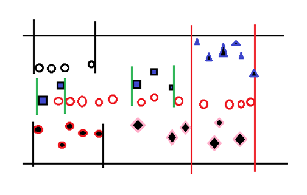

# 基于Spark分布式处理的文本聚类框架

###1. 文本流聚类框架
- 互联网上存在大量的文本数据，而且每天又会有海量的新增数据，这些数据离散无序，为了发现规律，往往第一步是对文本进行聚类，以结构化这些数据。但是文本流数数据不同于普通文本的聚类，文本流的当前状态随时间变化，文本流的背后其实是事件的传播，因此做好文本聚类，一定要做到跟踪事件，这个问题在学术上定义为TDT(Topic detection and tracking)。基本的TDT问题如下图：

      
  
- 这里采用**时间窗滑动聚类**，自动把文本流按照**时间和内容**相关性聚类。每一个小类成为一个*story*，**表示背后的一个事件发生后的传播始末**。
  - 时间窗口设为d天，聚类递增步长为1天。即当天聚类过去d天的文本加上当前活跃的story包含的文本。
  - 活跃的story只要在d天内被提到就会一直保持活跃，这个条件有时候可以更加严格，要根据具体情况设置条件。聚类结果如下图形象展示：
 
      
      
###2. 聚类方法选择:
- 层次聚类。基于下面的因素，选择层次聚类：
 - 因为是增量聚类，会有大量重复聚类，需要聚类算法稳定，故没有用kmeans；
 - 无法得到聚类数目
 - d天的文本流量可能非常大

###3. 文本特征:
- tf-idf。统计大量文本的df值，计算文本的tfidf，mapred实现方便高效。

###4. Spark实现
- 使用Spark实现增量聚类，Spark灵活方便，Spark SQL查询速度快，可以直接利用上一步mapred计算出的文本向量。
- 主要的时间瓶颈在距离矩阵的计算，采用余弦距离度量文本距离，mapred矩阵乘法计算距离矩阵。
- 利用距离矩阵分块，每一块单独层次聚类，即不影响结果，又能极大提高聚类速度。

###5. Spark调优
- paralellize

###6. 未来优化方向
